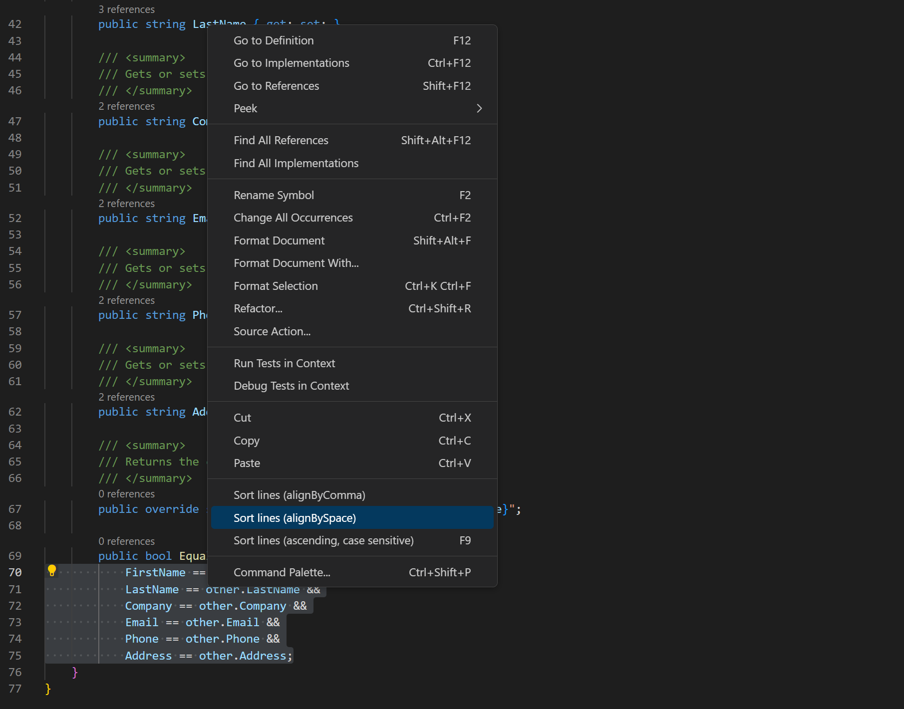
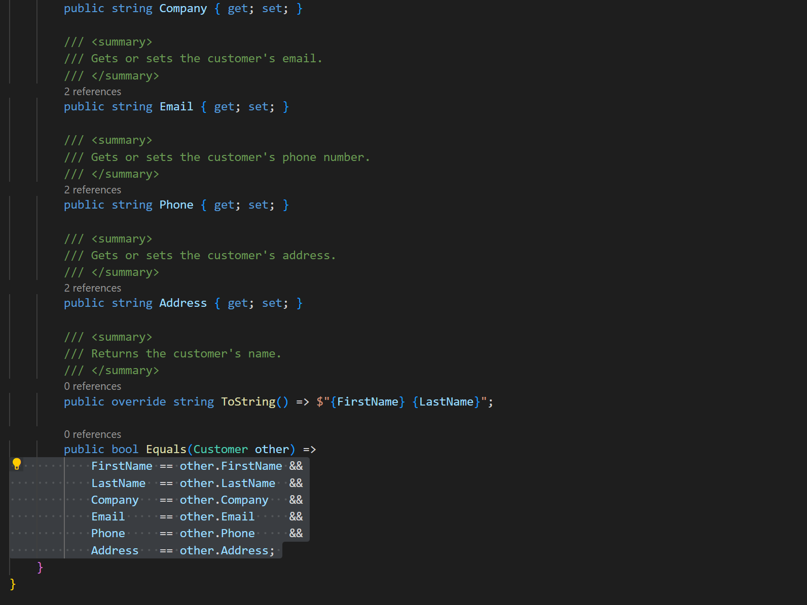

# Functionality
Source code is forked from https://github.com/Tyriar/vscode-sort-lines.
Align lines by space helps to bulk editing.

## Install

https://code.visualstudio.com/docs/editor/extension-marketplace#_install-from-a-vsix

## Screenshot

 
 

